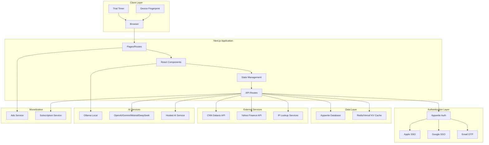
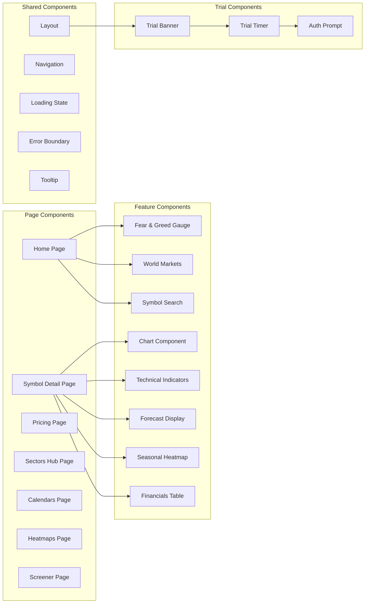
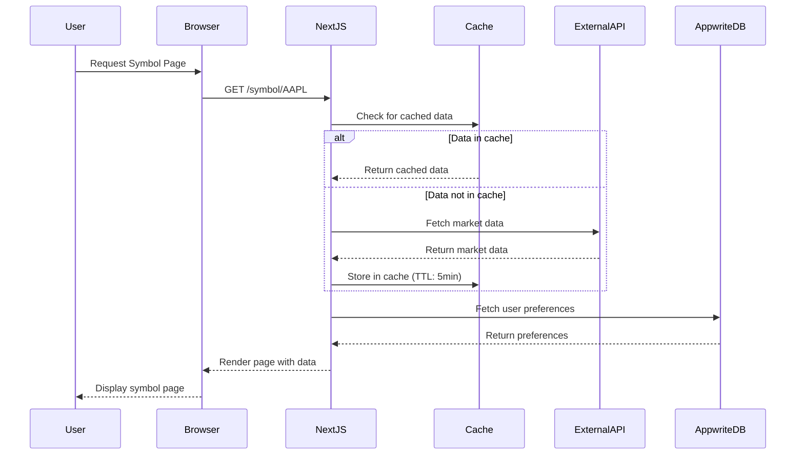

# Design Document: Stock Exchange Application

## Overview

The Stock Exchange Application is a comprehensive web platform designed for individual long-term investors to access visualized market data, technical indicators, forecasts, and seasonal patterns with plain-language explanations. The system provides a 15-minute trial experience for unauthenticated users, followed by five distinct pricing tiers that cater to different user needs ranging from ad-supported free access to privacy-focused local AI and hosted AI solutions.

### Key Features

- Multi-provider authentication (Apple SSO, Google SSO, Email OTP)
- Real-time market data visualization with technical indicators
- Multiple analysis views: Overview, Financials, Technicals, Forecasts, Seasonals
- 15-minute trial with device fingerprinting and IP tracking
- Five pricing tiers: Free (with ads), Ads-free, Local (Ollama), BYOK, Hosted AI
- Advanced features: Sectors Hub, Economic/Earnings/Dividend/IPO Calendars, Heatmaps, Asset Screener
- Integration with CNN dataviz and Yahoo Finance APIs
- Built on Next.js and deployed to Vercel

### Technology Stack

- **Frontend Framework**: Next.js 14+ with App Router
- **Deployment Platform**: Vercel
- **Authentication**: Appwrite (existing infrastructure)
- **Database**: Appwrite Database (existing infrastructure)
- **Charting Library**: Lightweight Charts by TradingView or Recharts
- **Data Sources**: CNN dataviz API, Yahoo Finance API
- **AI Integration**: Ollama (local), OpenAI/Gemini/Mistral/DeepSeek (BYOK), Hosted AI service
- **Styling**: Tailwind CSS
- **State Management**: React Context API + SWR for data fetching
- **Device Fingerprinting**: FingerprintJS or custom implementation

## Architecture

### System Architecture

The application follows a modern serverless architecture leveraging Next.js API routes and Vercel's edge network:



### Component Architecture



### Data Flow Architecture



## Components and Interfaces

### Core Components

#### 1. Authentication Service

**Purpose**: Handle user authentication via multiple providers

**Interface**:

```typescript
interface AuthenticationService {
  signInWithApple(): Promise<AuthResult>;
  signInWithGoogle(): Promise<AuthResult>;
  signInWithEmail(email: string): Promise<void>;
  verifyEmailOTP(token: string): Promise<AuthResult>;
  signOut(): Promise<void>;
  getCurrentUser(): Promise<User | null>;
  onAuthStateChange(callback: (user: User | null) => void): () => void;
}

interface AuthResult {
  success: boolean;
  user?: User;
  error?: string;
}

interface User {
  id: string;
  email: string;
  name?: string;
  pricingTier: PricingTier;
  preferences: UserPreferences;
}
```

**Dependencies**: Appwrite SDK, OAuth providers

#### 2. Market Data Service

**Purpose**: Fetch, cache, and serve market data from external APIs

**Interface**:

```typescript
interface MarketDataService {
  getSymbolData(symbol: string): Promise<SymbolData>;
  getHistoricalPrices(symbol: string, range: TimeRange): Promise<PriceData[]>;
  getTechnicalIndicators(symbol: string): Promise<TechnicalIndicators>;
  getForecastData(symbol: string): Promise<ForecastData>;
  getSeasonalPatterns(symbol: string): Promise<SeasonalData>;
  getFinancials(symbol: string): Promise<FinancialData>;
  getFearGreedIndex(): Promise<FearGreedData>;
  getWorldMarkets(): Promise<MarketIndex[]>;
  getSectorPerformance(): Promise<SectorData[]>;
  invalidateCache(symbol: string): Promise<void>;
}

interface SymbolData {
  symbol: string;
  name: string;
  price: number;
  change: number;
  changePercent: number;
  marketCap: number;
  volume: number;
  fiftyTwoWeekHigh: number;
  fiftyTwoWeekLow: number;
  lastUpdated: Date;
}

type TimeRange = "1D" | "1W" | "1M" | "3M" | "1Y" | "5Y" | "Max";
```

**Dependencies**: CNN dataviz API, Yahoo Finance API, Cache service

#### 3. Trial Management Service

**Purpose**: Manage trial sessions with device fingerprinting and IP tracking

**Interface**:

```typescript
interface TrialManagementService {
  startTrial(): Promise<TrialSession>;
  getTrialStatus(): Promise<TrialStatus>;
  endTrial(): Promise<void>;
  checkTrialEligibility(): Promise<boolean>;
  generateDeviceFingerprint(): Promise<string>;
  trackIPAddress(): Promise<string | null>;
}

interface TrialSession {
  id: string;
  startTime: Date;
  endTime: Date;
  isActive: boolean;
  deviceFingerprint: string;
  ipAddress?: string;
}

interface TrialStatus {
  isActive: boolean;
  remainingSeconds: number;
  hasUsedTrial: boolean;
}
```

**Dependencies**: FingerprintJS, IP lookup services, Browser storage

#### 4. Subscription Service

**Purpose**: Manage user subscriptions and pricing tiers

**Interface**:

```typescript
interface SubscriptionService {
  getPricingTiers(): Promise<PricingTierInfo[]>;
  getCurrentTier(userId: string): Promise<PricingTier>;
  subscribeTier(userId: string, tier: PricingTier): Promise<SubscriptionResult>;
  upgradeTier(
    userId: string,
    newTier: PricingTier
  ): Promise<SubscriptionResult>;
  downgradeTier(
    userId: string,
    newTier: PricingTier
  ): Promise<SubscriptionResult>;
  cancelSubscription(userId: string): Promise<void>;
}

type PricingTier = "FREE" | "ADS_FREE" | "LOCAL" | "BYOK" | "HOSTED_AI";

interface PricingTierInfo {
  tier: PricingTier;
  name: string;
  description: string;
  features: string[];
  price: number;
  billingPeriod: "monthly" | "yearly";
}

interface SubscriptionResult {
  success: boolean;
  subscription?: Subscription;
  error?: string;
}
```

**Dependencies**: Payment processor, Appwrite Database

#### 5. AI Integration Service

**Purpose**: Provide AI-powered explanations and insights

**Interface**:

```typescript
interface AIIntegrationService {
  explainMetric(
    metric: string,
    value: number,
    context: any
  ): Promise<AIExplanation>;
  analyzeChart(
    chartData: PriceData[],
    indicators: TechnicalIndicators
  ): Promise<AIAnalysis>;
  answerQuestion(question: string, context: SymbolData): Promise<AIResponse>;
  validateAPIKey(provider: AIProvider, apiKey: string): Promise<boolean>;
  setAIProvider(provider: AIProvider, config: AIConfig): Promise<void>;
}

type AIProvider =
  | "OLLAMA"
  | "OPENAI"
  | "GEMINI"
  | "MISTRAL"
  | "DEEPSEEK"
  | "HOSTED";

interface AIExplanation {
  text: string;
  visualAnnotations: VisualAnnotation[];
  relatedMetrics: string[];
}

interface VisualAnnotation {
  type: "highlight" | "arrow" | "circle" | "label";
  target: string; // CSS selector or data point identifier
  position: { x: number; y: number };
  label?: string;
}

interface AIAnalysis {
  summary: string;
  keyPoints: string[];
  visualAnnotations: VisualAnnotation[];
  confidence: number;
}
```

**Dependencies**: Ollama, OpenAI SDK, Google AI SDK, Mistral SDK, DeepSeek SDK

#### 6. Chart Component

**Purpose**: Render interactive financial charts

**Interface**:

```typescript
interface ChartComponentProps {
  data: PriceData[];
  type: "line" | "area" | "candlestick";
  timeRange: TimeRange;
  indicators?: ChartIndicator[];
  annotations?: VisualAnnotation[];
  onTimeRangeChange?: (range: TimeRange) => void;
  onDataPointHover?: (point: PriceData) => void;
  responsive?: boolean;
}

interface PriceData {
  timestamp: Date;
  open: number;
  high: number;
  low: number;
  close: number;
  volume: number;
}

interface ChartIndicator {
  type: "MA" | "EMA" | "RSI" | "MACD" | "BB";
  period?: number;
  color?: string;
  visible: boolean;
}
```

**Dependencies**: Lightweight Charts or Recharts library

#### 7. Heatmap Component

**Purpose**: Render performance heatmaps for various asset types

**Interface**:

```typescript
interface HeatmapComponentProps {
  data: HeatmapData[];
  type: "ETF" | "CRYPTO" | "STOCK" | "MATRIX";
  timeRange: TimeRange;
  colorScheme: ColorScheme;
  onTileClick?: (item: HeatmapData) => void;
  onTileHover?: (item: HeatmapData) => void;
}

interface HeatmapData {
  symbol: string;
  name: string;
  value: number;
  changePercent: number;
  sector?: string;
  marketCap?: number;
}

interface ColorScheme {
  positive: string[];
  negative: string[];
  neutral: string;
}
```

**Dependencies**: D3.js or custom canvas rendering

#### 8. Asset Screener Component

**Purpose**: Filter and display assets based on multiple criteria

**Interface**:

```typescript
interface AssetScreenerProps {
  onResultsChange?: (results: ScreenerResult[]) => void;
}

interface ScreenerFilter {
  field: string;
  operator: "gt" | "lt" | "eq" | "between" | "in";
  value: number | string | [number, number] | string[];
}

interface ScreenerPreset {
  id: string;
  name: string;
  description: string;
  filters: ScreenerFilter[];
}

interface ScreenerResult {
  symbol: string;
  name: string;
  price: number;
  changePercent: number;
  volume: number;
  marketCap: number;
  sector: string;
  metrics: Record<string, number>;
  valuationContext: "overpriced" | "underpriced" | "fair";
}
```

**Dependencies**: Market Data Service

### API Routes

#### Market Data Routes

```typescript
// GET /api/market/symbol/[symbol]
// Returns current data for a specific symbol

// GET /api/market/historical/[symbol]?range=1Y
// Returns historical price data

// GET /api/market/indicators/[symbol]
// Returns technical indicators

// GET /api/market/forecast/[symbol]
// Returns analyst forecasts and estimates

// GET /api/market/seasonal/[symbol]
// Returns seasonal pattern data

// GET /api/market/financials/[symbol]
// Returns financial statements and metrics

// GET /api/market/fear-greed
// Returns Fear and Greed Index

// GET /api/market/world-markets
// Returns global market indices

// GET /api/market/sectors
// Returns sector performance data
```

#### Trial Routes

```typescript
// POST /api/trial/start
// Starts a new trial session
// Body: { deviceFingerprint: string }

// GET /api/trial/status
// Returns current trial status

// POST /api/trial/end
// Ends the current trial session

// GET /api/trial/eligibility
// Checks if device is eligible for trial
```

#### Subscription Routes

```typescript
// GET /api/subscription/tiers
// Returns available pricing tiers

// GET /api/subscription/current
// Returns user's current subscription

// POST /api/subscription/subscribe
// Creates a new subscription
// Body: { tier: PricingTier, paymentMethod: string }

// PUT /api/subscription/upgrade
// Upgrades to a higher tier
// Body: { newTier: PricingTier }

// PUT /api/subscription/downgrade
// Downgrades to a lower tier
// Body: { newTier: PricingTier }

// DELETE /api/subscription/cancel
// Cancels current subscription
```

#### Calendar Routes

```typescript
// GET /api/calendar/economic?country=US&importance=high
// Returns economic events

// GET /api/calendar/earnings?startDate=2024-01-01&endDate=2024-01-31
// Returns earnings announcements

// GET /api/calendar/dividends?country=US&timezone=EST
// Returns dividend payments

// GET /api/calendar/ipos?startDate=2024-01-01
// Returns upcoming IPOs
```

#### Screener Routes

```typescript
// POST /api/screener/search
// Searches assets based on filters
// Body: { filters: ScreenerFilter[], preset?: string }

// GET /api/screener/presets
// Returns available screener presets

// POST /api/screener/presets
// Saves a custom preset
// Body: { name: string, filters: ScreenerFilter[] }

// GET /api/screener/export?format=csv
// Exports screener results
```

## Data Models

### User Model

```typescript
interface User {
  id: string;
  email: string;
  name?: string;
  authProvider: "apple" | "google" | "email";
  pricingTier: PricingTier;
  subscription?: Subscription;
  preferences: UserPreferences;
  watchlist: string[]; // Array of symbols
  createdAt: Date;
  lastLoginAt: Date;
}

interface UserPreferences {
  defaultTimeRange: TimeRange;
  defaultChartType: "line" | "area" | "candlestick";
  enabledIndicators: string[];
  theme: "light" | "dark" | "auto";
  notifications: NotificationPreferences;
}

interface NotificationPreferences {
  earnings: boolean;
  dividends: boolean;
  priceAlerts: boolean;
  economicEvents: boolean;
}
```

### Subscription Model

```typescript
interface Subscription {
  id: string;
  userId: string;
  tier: PricingTier;
  status: "active" | "cancelled" | "expired" | "past_due";
  startDate: Date;
  endDate?: Date;
  billingPeriod: "monthly" | "yearly";
  amount: number;
  currency: string;
  paymentMethod: string;
  aiConfig?: AIConfig;
}

interface AIConfig {
  provider: AIProvider;
  apiKey?: string; // Encrypted, only for BYOK tier
  model?: string;
  settings: Record<string, any>;
}
```

### Trial Session Model

```typescript
interface TrialSession {
  id: string;
  deviceFingerprint: string;
  ipAddress?: string;
  startTime: Date;
  endTime: Date;
  isActive: boolean;
  userAgent: string;
  screenResolution: string;
  timezone: string;
  createdAt: Date;
}
```

### Market Data Cache Model

```typescript
interface CachedMarketData {
  key: string; // Composite key: symbol + data type
  symbol: string;
  dataType:
    | "quote"
    | "historical"
    | "indicators"
    | "forecast"
    | "seasonal"
    | "financials";
  data: any;
  cachedAt: Date;
  expiresAt: Date;
  ttl: number; // Time to live in seconds
}
```

### Calendar Event Models

```typescript
interface EconomicEvent {
  id: string;
  name: string;
  country: string;
  date: Date;
  time?: string;
  importance: "high" | "medium" | "low";
  description: string;
  previous?: string;
  forecast?: string;
  actual?: string;
}

interface EarningsEvent {
  id: string;
  symbol: string;
  companyName: string;
  date: Date;
  time?: string;
  epsEstimate?: number;
  epsActual?: number;
  epsSurprise?: number;
  epsSurprisePercent?: number;
  revenueEstimate?: number;
  revenueActual?: number;
}

interface DividendEvent {
  id: string;
  symbol: string;
  companyName: string;
  amount: number;
  exDividendDate: Date;
  paymentDate: Date;
  recordDate?: Date;
  yield: number;
  frequency: "monthly" | "quarterly" | "semi-annual" | "annual";
}

interface IPOEvent {
  id: string;
  companyName: string;
  symbol?: string;
  expectedDate: Date;
  priceRangeLow?: number;
  priceRangeHigh?: number;
  sharesOffered?: number;
  exchange: string;
  underwriters?: string[];
}
```

### Screener Models

```typescript
interface ScreenerPreset {
  id: string;
  name: string;
  description: string;
  filters: ScreenerFilter[];
  isDefault: boolean;
  userId?: string; // null for system presets
  createdAt: Date;
}

interface ScreenerFilter {
  field: string;
  operator: "gt" | "lt" | "eq" | "gte" | "lte" | "between" | "in";
  value: number | string | [number, number] | string[];
  label: string;
}

interface ScreenerResult {
  symbol: string;
  name: string;
  sector: string;
  price: number;
  changePercent: number;
  volume: number;
  marketCap: number;
  peRatio?: number;
  pbRatio?: number;
  pegRatio?: number;
  dividendYield?: number;
  revenueGrowth?: number;
  earningsGrowth?: number;
  valuationContext: "overpriced" | "underpriced" | "fair";
  matchScore: number; // How well it matches the filters
}
```

## Correctness Properties

_A property is a characteristic or behavior that should hold true across all valid executions of a system—essentially, a formal statement about what the system should do. Properties serve as the bridge between human-readable specifications and machine-verifiable correctness guarantees._

### Property 1: Authentication Round Trip

_For any_ valid authentication provider (Apple SSO, Google SSO, or Email OTP) and valid credentials, successful authentication should create or retrieve a user session, and that session should contain the authenticated user's information.

**Validates: Requirements 1.2, 1.3, 1.4, 1.5**

### Property 2: Authentication Error Handling

_For any_ authentication failure (invalid credentials, network error, or provider unavailability), the system should display a descriptive error message and not create a session.

**Validates: Requirements 1.6**

### Property 3: Market Data Caching

_For any_ market data request, if the data is cached and the TTL has not expired, subsequent requests should return the cached data without making external API calls.

**Validates: Requirements 3.4, 17.2**

### Property 4: API Error Handling

_For any_ API request failure (network error, rate limit, or service unavailability), the system should display a user-friendly error message and provide a retry mechanism.

**Validates: Requirements 3.5, 14.2, 14.5**

### Property 5: Rate Limit Enforcement

_For any_ sequence of API requests within a time window, the number of requests should not exceed the configured rate limit, and when the limit is reached, cached data should be served if available.

**Validates: Requirements 17.1, 17.4**

### Property 6: Exponential Backoff

_For any_ sequence of failed API requests, the delay between retry attempts should increase exponentially (e.g., 1s, 2s, 4s, 8s).

**Validates: Requirements 17.5**

### Property 7: Trial Session Creation

_For any_ unauthenticated user accessing the application, a trial session should be created with start_time, end_time (15 minutes after start), is_active flag set to true, and a device_fingerprint generated from browser characteristics.

**Validates: Requirements 21.1, 21.2, 21.3**

### Property 8: Trial Enforcement

_For any_ device fingerprint that has previously been used for a trial, subsequent trial attempts should be denied and an authentication prompt should be displayed, regardless of browser mode or cleared cookies.

**Validates: Requirements 21.4, 21.5, 21.19**

### Property 9: Trial Timer Accuracy

_For any_ active trial session, the displayed remaining time should equal the difference between end_time and current time, accurate to the second.

**Validates: Requirements 21.9**

### Property 10: Trial Access Control

_For any_ trial session where is_active is true, all application features should be accessible; when is_active is false, an authentication prompt should be displayed.

**Validates: Requirements 21.11, 21.12**

### Property 11: Trial State Persistence

_For any_ trial session, refreshing the page should preserve the trial state (start_time, end_time, is_active, remaining time) using browser storage.

**Validates: Requirements 21.18**

### Property 12: API Key Encryption

_For any_ API key stored by the API_Key_Manager, the stored value should be encrypted, and decryption should yield the original key.

**Validates: Requirements 22.13**

### Property 13: API Key Validation

_For any_ API key provided by a user, the system should validate it with the corresponding AI provider before storing it, and invalid keys should be rejected with an error message.

**Validates: Requirements 22.14**

### Property 14: Tier Change Immediate Effect

_For any_ pricing tier change (upgrade or downgrade), the user's feature access should immediately reflect the new tier's capabilities.

**Validates: Requirements 22.24, 22.26**

### Property 15: Downgrade Grace Period

_For any_ downgrade from a paid tier, the user should retain access to the higher tier's features until the end of the current billing period.

**Validates: Requirements 22.27**

### Property 16: Technical Indicator Color Coding

_For any_ technical indicator value, the color should be red when indicating overpriced, green when indicating underpriced, and gray when indicating fairly priced, based on the indicator's threshold values.

**Validates: Requirements 5.4**

### Property 17: Screener Filter Conjunction

_For any_ set of screener filters applied, the results should include only assets that match ALL filter criteria (AND logic), and the count of results should match the number of assets meeting all criteria.

**Validates: Requirements 26.8**

### Property 18: Screener Preset Application

_For any_ screener preset selected, the applied filters should exactly match the preset's defined filter combination.

**Validates: Requirements 26.13**

### Property 19: Screener State Persistence

_For any_ screener filter configuration, refreshing the page should restore the same filter selections using browser storage.

**Validates: Requirements 26.23**

### Property 20: Custom Preset Round Trip

_For any_ custom screener preset saved by a user, retrieving the preset should return the exact same filter combination that was saved.

**Validates: Requirements 26.15**

### Property 21: Ollama Verification

_For any_ Local tier activation, the system should verify Ollama installation and accessibility before completing the activation, and should fail with an error message if Ollama is not available.

**Validates: Requirements 22.10**

### Property 22: Symbol Data Fetching

_For any_ valid stock symbol, requesting symbol data should either return current market data or return a cached version if within TTL, but should never fail silently.

**Validates: Requirements 3.1**

## Error Handling

### Error Categories

The application handles errors across multiple categories:

1. **Authentication Errors**
   - Invalid credentials
   - OAuth provider failures
   - Email OTP delivery failures
   - Session expiration

2. **API Errors**
   - Rate limiting (429)
   - Service unavailability (503)
   - Invalid requests (400)
   - Not found (404)
   - Network timeouts

3. **Trial Errors**
   - Trial expired
   - Device fingerprint collision
   - IP tracking failures
   - Browser storage unavailable

4. **Subscription Errors**
   - Payment processing failures
   - Invalid tier transitions
   - API key validation failures
   - Ollama unavailability (Local tier)

5. **Data Errors**
   - Symbol not found
   - Invalid date ranges
   - Malformed API responses
   - Cache corruption

### Error Handling Strategy

```typescript
interface ErrorResponse {
  code: string;
  message: string;
  userMessage: string;
  retryable: boolean;
  retryAfter?: number;
  details?: any;
}

class ApplicationError extends Error {
  constructor(
    public code: string,
    public userMessage: string,
    public retryable: boolean = false,
    public retryAfter?: number,
    public details?: any
  ) {
    super(userMessage);
  }
}
```

### Error Recovery Mechanisms

1. **Automatic Retry with Exponential Backoff**
   - Applies to: API requests, authentication attempts
   - Max retries: 3
   - Base delay: 1 second
   - Max delay: 8 seconds

2. **Fallback to Cached Data**
   - Applies to: Market data requests when API fails
   - Shows staleness indicator to user
   - Allows manual refresh

3. **Graceful Degradation**
   - Trial features: Fall back to localStorage if IP tracking fails
   - Charts: Show simplified version if full rendering fails
   - AI features: Disable if provider unavailable

4. **User-Initiated Retry**
   - All failed operations provide a "Retry" button
   - Retry preserves user context and form data
   - Shows loading state during retry

### Error Logging

All errors are logged with:

- Timestamp
- User ID (if authenticated)
- Error code and message
- Stack trace
- Request context (URL, method, payload)
- Browser information
- Trial/subscription status

## Testing Strategy

### Dual Testing Approach

The application requires both unit testing and property-based testing for comprehensive coverage:

- **Unit Tests**: Verify specific examples, edge cases, and error conditions
- **Property Tests**: Verify universal properties across all inputs

### Unit Testing

**Framework**: Jest + React Testing Library

**Coverage Areas**:

- Component rendering and user interactions
- Specific authentication flows (Apple SSO success, Google SSO failure, etc.)
- Edge cases: empty data, symbol not found, network offline
- Error message display
- Loading states
- Responsive layout breakpoints

**Example Unit Tests**:

```typescript
describe("TrialTimer", () => {
  it('should display "Symbol not found" for invalid symbol', () => {
    // Specific edge case
  });

  it("should show authentication prompt when trial expires", () => {
    // Specific example
  });

  it("should render correctly on mobile viewport", () => {
    // Responsive design test
  });
});
```

### Property-Based Testing

**Framework**: fast-check (JavaScript/TypeScript property-based testing library)

**Configuration**:

- Minimum 100 iterations per property test
- Each test tagged with: `Feature: stock-exchange-application, Property {number}: {property_text}`

**Coverage Areas**:

- Authentication round trips
- Caching behavior
- Trial session management
- API rate limiting
- Screener filter logic
- Data transformations

**Example Property Tests**:

```typescript
import fc from "fast-check";

describe("Property Tests", () => {
  it("Property 3: Market Data Caching", () => {
    // Feature: stock-exchange-application, Property 3: Market Data Caching
    fc.assert(
      fc.asyncProperty(
        fc.string(), // symbol
        fc.integer({ min: 1, max: 300 }), // TTL in seconds
        async (symbol, ttl) => {
          const firstFetch = await marketDataService.getSymbolData(symbol);
          const secondFetch = await marketDataService.getSymbolData(symbol);

          // Should return cached data without API call
          expect(secondFetch).toEqual(firstFetch);
          expect(apiCallCount).toBe(1);
        }
      ),
      { numRuns: 100 }
    );
  });

  it("Property 7: Trial Session Creation", () => {
    // Feature: stock-exchange-application, Property 7: Trial Session Creation
    fc.assert(
      fc.asyncProperty(
        fc.record({
          userAgent: fc.string(),
          screenResolution: fc.string(),
          timezone: fc.string(),
        }),
        async (browserInfo) => {
          const session = await trialService.startTrial();

          expect(session.startTime).toBeDefined();
          expect(session.endTime).toBeDefined();
          expect(session.isActive).toBe(true);
          expect(session.deviceFingerprint).toBeDefined();

          const duration =
            session.endTime.getTime() - session.startTime.getTime();
          expect(duration).toBe(15 * 60 * 1000); // 15 minutes
        }
      ),
      { numRuns: 100 }
    );
  });

  it("Property 17: Screener Filter Conjunction", () => {
    // Feature: stock-exchange-application, Property 17: Screener Filter Conjunction
    fc.assert(
      fc.asyncProperty(
        fc.array(
          fc.record({
            field: fc.constantFrom("peRatio", "marketCap", "volume"),
            operator: fc.constantFrom("gt", "lt", "between"),
            value: fc.oneof(fc.float(), fc.tuple(fc.float(), fc.float())),
          })
        ),
        async (filters) => {
          const results = await screenerService.search(filters);

          // Every result should match ALL filters
          for (const result of results) {
            for (const filter of filters) {
              expect(matchesFilter(result, filter)).toBe(true);
            }
          }
        }
      ),
      { numRuns: 100 }
    );
  });
});
```

### Integration Testing

**Framework**: Playwright

**Coverage Areas**:

- End-to-end authentication flows
- Trial session lifecycle
- Subscription purchase flows
- Multi-page navigation
- API integration with external services

### Performance Testing

**Tools**: Lighthouse CI, WebPageTest

**Targets**:

- Lighthouse performance score > 80
- First Contentful Paint < 1.5s
- Time to Interactive < 3.5s
- Cumulative Layout Shift < 0.1

### Accessibility Testing

**Tools**: axe-core, WAVE

**Requirements**:

- WCAG 2.1 Level AA compliance
- Keyboard navigation support
- Screen reader compatibility
- Color contrast ratios ≥ 4.5:1
